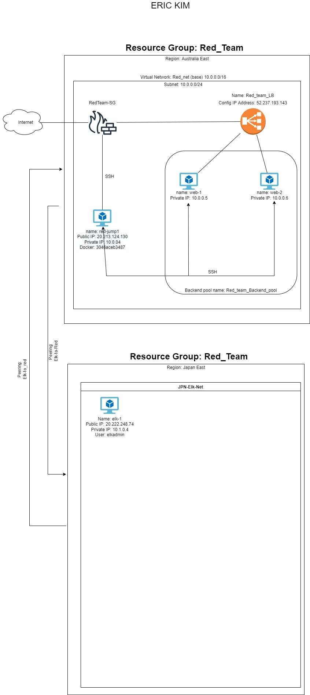

# Cloud Network
Various scripts from my time in the MSU cybersecurity Bootcamp

This is a collection of Linux Scripts and Ansible Scripts from my CyberClass.
In Linux, we were to use Bash commands to sort through some data to find a dealer and player who were involved in embezzlement.

Most of the scripts are used to configure cloud servers with different docker containers.

The final setup was 4 servers running vulnerable DVWA containers along with a jump box and a server running an ELK stack container.

